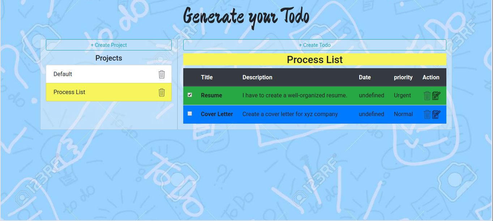

<h1 align='center'>__Generate Your Todo__</h1>

> Is a Webapp that performs a set of actions to store a user&#39;s Project name with their divided tasks, enlisted with title, description, priority, end date. User can mark the project that is done.  

## Table of Contents

- [Background](#background)
- [Install](#install)
- [Usage](#usage)
- [Live](#live)
- [Potential Future Feature](#potential-future-feature)
- [Maintainers](#maintainers)
- [Contributing](#contributing)
- [License](#license)

## Background

1. JavaScript
2. HTML5 CSS3 SCSS
3. Bootstrap

## Install

1. Run `npm install` It will install all the dependencies required by the project.

## Usage

1. Clone the repository: `git clone git@github.com:shshamim63/Todo-App.git`
2. Enter into the folder: `cd Todo-App`
3. Run `npm start` to start the development server. It will automatically open the page in your default browser.
4. Run `npm run build` to get a minimized deployable version.

## Live

You can see the live version in [here](https://generate-todo.netlify.com/).

## Potential Future Feature

- Improve User Interface.
- Implement serverside operation to store user data.

## Maintainers

👤 **Shakhawat Hossain**

- Github: [@shshamim63](https://github.com/shshamim63)
- LinkedIn: [@shakhawathossainshamim](https://www.linkedin.com/in/shakhawathossainshamim/)
- Twitter: [@Shshamim090](https://twitter.com/Shshamim090)

## Contributing
🤝 PRs accepted. 
1. Fork it (https://github.com/shshamim63/Todo-App)
2. Create your feature branch (git checkout -b feature/[choose-a-name])
3. Commit your changes (git commit -am 'what this commit will fix/add')
4. Push to the branch (git push origin feature/[chosen-name])
5. Create

## License

MIT © 2019 Shakhawat Hossain
